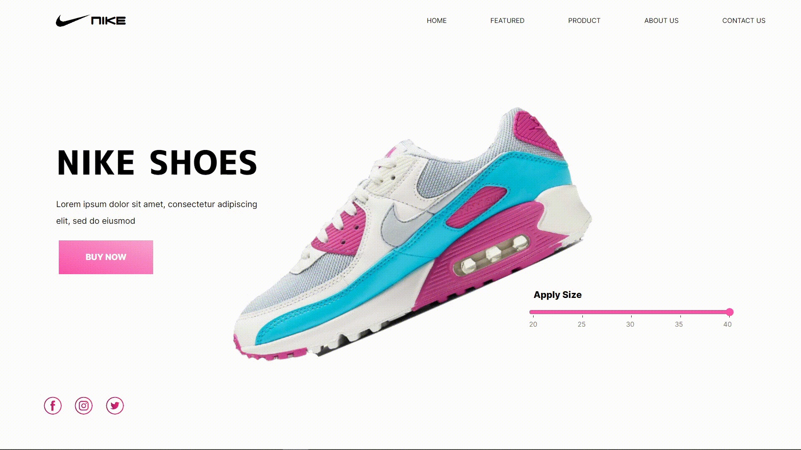

# Nike Website

## Description

This is currently a webpage designed using purely HTML and CSS. It is responsive in nature but breaks in case of certain screen sizes.

## Demo 

The `.gif` file below shows the look and feel of the web page.

The `demo.gif` file might take some time to appear in case of slower network speeds. 
Also note that the animations might appear to be slower than they actually are.

## Deployment

This site is currently deployed using github pages [here](https://rohan-verma19.github.io/nike-website/).

## TODO

- Implement flexbox vertically as well.
- Improve versatility of page design according to different screen sizes.
